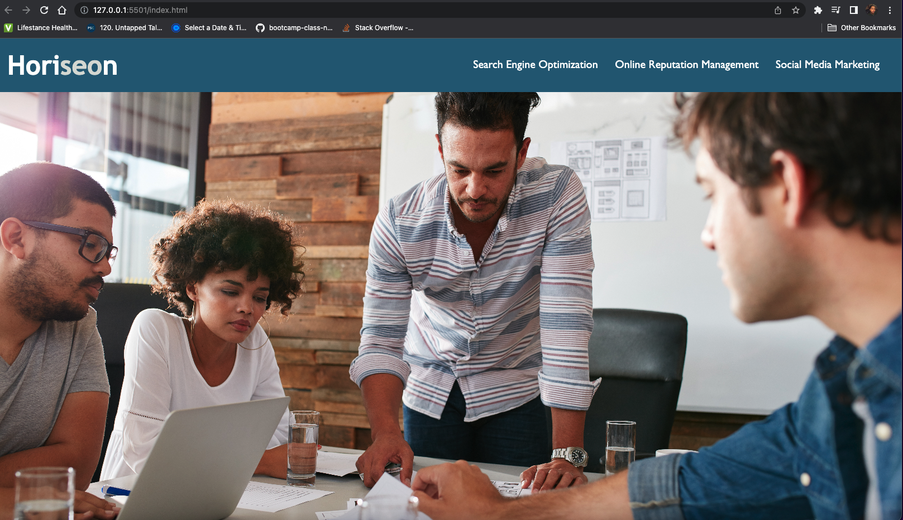

# hw-challenge-1

# Description

This is the first HW challenge. I was tasked with making a website more accessible for the client. The client gave specific instructions on how to do this such as adding alt elements as well making sure the html code was in sematic structure. The website links were checked to make sure they are working. The css code was also cleaned up to make it more organized.

